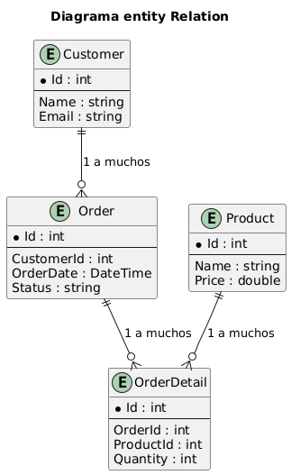
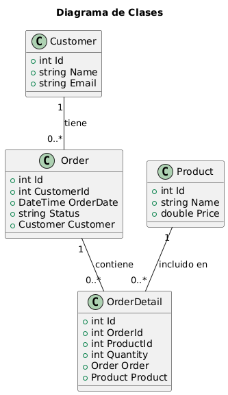

# SistemaGestionClientesPedidos_HU1

Una API RESTful para administrar clientes y sus pedidos.
[Enunciado](./assets/Taller_HU1_Asp.NEt.pdf)

## Objetivo General

Desarrollar una **API RESTful** utilizando **.NET 8** y **arquitectura DDD (Domain-Driven Design)** para gestionar clientes, productos y pedidos, aplicando buenas prácticas de desarrollo y persistencia de datos con **Entity Framework Core**.

---

## Objetivos Específicos

- Implementar una estructura de proyecto limpia y mantenible mediante capas: **Api**, **Application**, **Domain** e **Infrastructure**.  
- Modelar el dominio mediante entidades que representen el negocio real (clientes, pedidos y productos).  
- Configurar la base de datos y repositorios para manejar la persistencia con EF Core.  
- Exponer endpoints RESTful que permitan operaciones CRUD sobre las entidades principales.  
- Validar el correcto funcionamiento del sistema mediante pruebas en **Postman** o **Swagger**.

---

## Arquitectura del Proyecto

El proyecto sigue el patrón **Domain-Driven Design (DDD)**, con separación de responsabilidades en cuatro capas:

| Capa | Responsabilidad |
|------|------------------|
| **Api** | Contiene los controladores y la configuración de endpoints. |
| **Application** | Implementa la lógica de negocio mediante servicios. |
| **Domain** | Define las entidades y reglas del dominio. |
| **Infrastructure** | Gestiona la persistencia de datos y configuración de EF Core. |

---

## Entidades del Dominio

| Entidad | Descripción | Relaciones |
|----------|--------------|-------------|
| **Customer** | Representa al cliente del sistema. | 1:N con `Order` |
| **Order** | Representa un pedido hecho por un cliente. | 1:N con `OrderDetail`, N:1 con `Customer` |
| **OrderDetail** | Detalle de productos dentro de un pedido. | N:1 con `Order`, N:1 con `Product` |
| **Product** | Representa los productos disponibles en el sistema. | 1:N con `OrderDetail` |

---

## Diagramas del Sistema

### 1. Diagrama de Casos de Uso

Representa las principales funcionalidades que ofrece la API al consumidor externo.


> Muestra al actor “Consumidor API” interactuando con los tres procesos principales: gestión de clientes, pedidos y productos.

---

### 2. Diagrama Entidad-Relación (E-R)

Describe cómo se relacionan las entidades del dominio dentro de la base de datos.



> Define las relaciones entre Customer, Order, OrderDetail y Product para garantizar la integridad referencial de los datos.

---

### 3. Diagrama de Clases

Refleja la estructura lógica del dominio en términos de clases y asociaciones.



> Muestra las propiedades y dependencias entre las clases que conforman el modelo de dominio.

---

## Historias de Usuario (Resumen)

> [Historias de Usuario](./assets/UserStory.pdf)

1. **Configuración inicial del proyecto:**  
   Crear la estructura base del proyecto en .NET 8 con arquitectura DDD y configurar Entity Framework Core.

2. **Definición del dominio:**  
   Definir las entidades principales del sistema (Customer, Order, OrderDetail, Product) y sus relaciones.

3. **Configuración de la base de datos e infraestructura:**  
   Implementar el DbContext, los repositorios y la inyección de dependencias.

4. **Implementación de servicios (Application):**  
   Crear los servicios que contengan la lógica de negocio para clientes, pedidos y productos.

5. **Creación de controladores y endpoints:**  
   Exponer endpoints RESTful funcionales para gestionar las operaciones del sistema.

---

## Lista de backlog / Issues

### Historia 1: Configuración inicial del proyecto

- Issue 1: Crear la solución .NET 8 con las 4 capas  
- Issue 2: Configurar Entity Framework Core  
- Issue 3: Agregar conexión a base de datos  
- Issue 4: Crear la migración inicial y actualizar la base de datos  

### Historia 2: Definición del dominio

- Issue 5: Crear entidad Customer  
- Issue 6: Crear entidad Order  
- Issue 7: Crear entidad OrderDetail  
- Issue 8: (Opcional) Crear entidad Product  

### Historia 3: Configuración de la base de datos e infraestructura

- Issue 9: Crear DbContext y DbSet para las entidades  
- Issue 10: Implementar repositorios genéricos y específicos  
- Issue 11: Configurar inyección de dependencias entre capas  

### Historia 4: Implementación de servicios (Application)

- Issue 12: Crear servicio para gestión de clientes  
- Issue 13: Crear servicio para gestión de pedidos  
- Issue 14: Crear servicio para gestión de productos  
- Issue 15: Validar reglas de negocio (por ejemplo, no crear pedido sin cliente)  

### Historia 5: Creación de controladores y endpoints

- Issue 16: Crear controlador de clientes  
- Issue 17: Crear controlador de pedidos  
- Issue 18: Crear controlador de productos  
- Issue 19: Probar endpoints con Postman y validar respuestas  

---

## Tecnologías Utilizadas

- **.NET 8**
- **Entity Framework Core**
- **C#**
- **SQL Server LocalDB**
- **Postman** para pruebas

---

## Paquetes instalados y versiones exactas

- `Microsoft.EntityFrameworkCore` → Mapeado de objetos.
  Versión: **9.0.9**

```bash
dotnet add package Microsoft.EntityFrameworkCore --version 9.0.9
```

- `Microsoft.EntityFrameworkCore.Tools` → Herramientas de consola para migraciones y actualización de base de datos.
  Versión: **9.0.9**

```bash
dotnet add package Microsoft.EntityFrameworkCore.Tools --version 9.0.9
```

- `Pomelo.EntityFrameworkCore.MySql` → Proveedor de EF Core para MySQL/MariaDB.
  Versión: **9.0.0**

```bash
dotnet add package Pomelo.EntityFrameworkCore.MySql --version 9.0.0
```

- Verificar paquetes instalados:

```bash
  dotnet list package
```

> Se recomienda usar exactamente las versiones indicadas para evitar conflictos de compatibilidad.

---

## Autores

Proyecto desarrollado por el equipo de la célula **Nebula** de desarrollo.

- Luisa Fernanda Rondón Moreno
- Jhos Kevin Agudelo Moreno
- Sarah Orianna Pérez Hernández
- Miguel Angel Angarita
